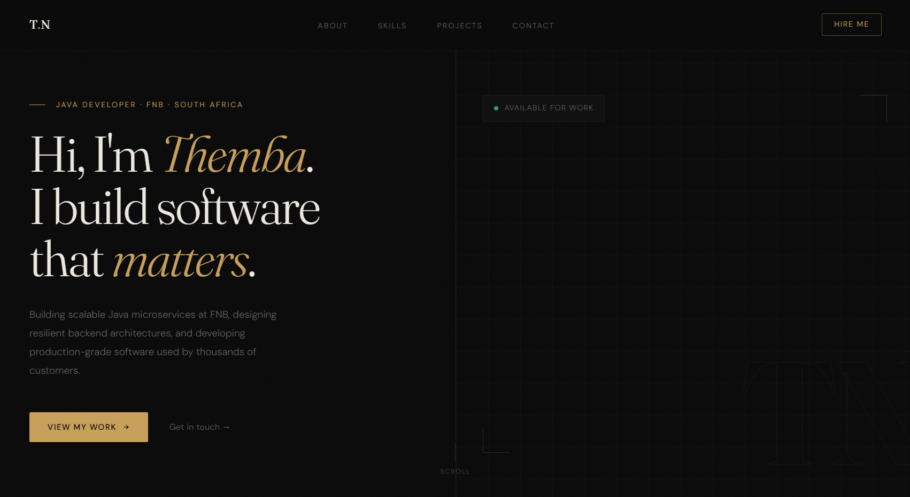

<div align="center">

# Themba Ngobeni — Portfolio V3
(https://thembangobeni.vercel.app/)[https://thembangobeni.vercel.app/]
### Dark Editorial Developer Portfolio

[](https://nextjs.org/)
[](https://www.typescriptlang.org/)
[](https://tailwindcss.com/)
[](https://vercel.com/)


A dark editorial portfolio built with **Next.js 14**, **TypeScript**, and **Tailwind CSS**. Designed with a luxury, minimal aesthetic featuring a frosted glass navbar, scroll-reveal animations, and a clean typographic system using Fraunces and DM Sans.


</div>

---

## Tech Stack

| Category | Technology |
|----------|-----------|
| Framework | Next.js 14 (App Router) |
| Language | TypeScript |
| Styling | Tailwind CSS + CSS custom properties |
| Fonts | Fraunces (display) · DM Sans (body) |
| Deployment | Vercel / Netlify |

---

## Getting Started

### Prerequisites

[](https://nodejs.org/)
[](https://www.npmjs.com/)

### Installation

```bash
# Clone the repository
git clone https://github.com/ThembaTman0/portfolio-v3.git
cd portfolio-v3

# Install dependencies
npm install

# Start the development server
npm run dev
```

Open [http://localhost:3000](http://localhost:3000) in your browser.

---

## Project Structure

```
portfolio-v3/
├── app/
│   ├── globals.css       # CSS variables, animations, utility classes
│   ├── layout.tsx        # Root layout, Navbar, Footer, scroll reveal script
│   └── page.tsx          # Home page, composes all sections
├── components/
│   ├── Navbar.tsx        # Frosted glass fixed navbar with top gold hairline
│   ├── Hero.tsx          # Landing section, headline, CTA, decorative panel
│   ├── About.tsx         # Bio, stats, photo card, tech chips
│   ├── Skills.tsx        # Skills grid with proficiency labels
│   ├── Projects.tsx      # Editorial project list with GitHub/live links
│   ├── Experience.tsx    # Work experience and education timeline
│   ├── Contact.tsx       # Contact email and social links
│   └── Footer.tsx        # Copyright and back to top
├── constants/
│   └── index.ts          # All data: nav links, skills, projects, experience, socials
└── public/
    └── profile.jpg       # Add your profile photo here
```

---

## Customisation

All content lives in one file: **`constants/index.ts`**. Update it to make the portfolio your own.

### Personal Details

Edit `Hero.tsx` and `About.tsx` for your name, role, and bio text.

### Navigation Links

```ts
export const NAV_LINKS = [
  { href: "#about",    key: "about",    label: "About" },
  { href: "#skills",   key: "skills",   label: "Skills" },
  { href: "#projects", key: "projects", label: "Projects" },
  { href: "#contact",  key: "contact",  label: "Contact" },
];
```

### Skills

Proficiency options: `"Expert"` · `"Advanced"` · `"Proficient"` · `"Familiar"`

```ts
export const SKILLS = [
  { name: "Java", proficiency: "Expert", category: "Backend" },
  // ...
];
```

### Projects

```ts
export const PROJECTS = [
  {
    id: "01",
    title: "Project Name",
    subtitle: "Tech · Stack · Here",
    description: "Short description of what you built and why it matters.",
    tags: ["Tag1", "Tag2"],
    github: "https://github.com/you/repo",
    demo: "https://yoursite.com",   // set to null if no live demo
  },
];
```

### Experience

```ts
export const EXPERIENCE = [
  {
    role: "Job Title",
    company: "Company Name",
    period: "2023 — Present",
    description: "What you do there.",
    tech: ["Java", "Spring Boot"],
  },
];
```

### Profile Photo

Drop your image into `public/` (e.g. `public/profile.jpg`), then in `About.tsx` replace the monogram placeholder with:

```tsx
import Image from "next/image";

<Image
  src="/profile.jpg"
  alt="Your Name"
  fill
  style={{ objectFit: "cover", objectPosition: "center top" }}
  priority
/>
```

### Colours

All colours are defined as CSS variables in `app/globals.css`:

```css
:root {
  --bg:      #0a0a0a;   /* Page background */
  --accent:  #c8a05a;   /* Gold, primary accent */
  --accent2: #b86840;   /* Amber, hover state */
  --text:    #ddd8cf;   /* Body text */
  --muted:   #64605b;   /* Secondary text */
  --white:   #ede9e1;   /* Headings */
}
```

---

## Deployment

### Vercel (Recommended)

[](https://vercel.com/new)

1. Push your project to GitHub
2. Go to [vercel.com](https://vercel.com) and click **Add New Project**
3. Import your repo and leave all settings as default
4. Click **Deploy**

Vercel auto-deploys on every push to `main`.

### Netlify

[](https://app.netlify.com/start)

1. Install the adapter:

```bash
npm install -D @netlify/plugin-nextjs
```

2. Create `netlify.toml` in the project root:

```toml
[build]
  command = "npm run build"
  publish = ".next"

[[plugins]]
  package = "@netlify/plugin-nextjs"
```

3. Import your GitHub repo in Netlify and deploy.

---

## Common Issues

**ChunkLoadError on first load**

Delete the stale build cache and restart:

```powershell
# PowerShell
Remove-Item -Recurse -Force .next
npm run dev
```

```bash
# macOS / Linux
rm -rf .next
npm run dev
```

---

## License

MIT — free to use and adapt for your own portfolio.
